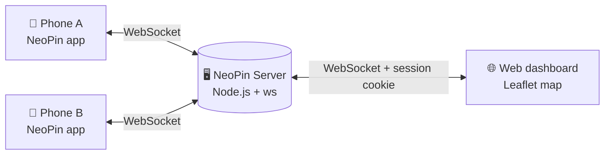

<div align="center">


<br>

**Self-hosted location sharing for people who would rather not hand their whereabouts to Google.**
A React Native app for your phones, a tiny Node.js server on your own machine, one map with everyone on it.

[](https://expo.dev)
[](https://reactnative.dev)
[](https://github.com/vxnsin/NeoPin/tree/Server)
[](LICENSE)
[](#build-the-app)

<br>


</div>

---

## Contents

- [How it works](#how-it-works)
- [Repository layout](#repository-layout)
- [Features](#features)
- [Quick start](#quick-start)
- [Build the app](#build-the-app)
- [Protocol](#protocol)
- [App structure](#app-structure)
- [Tests](#tests)
- [Roadmap](#roadmap)
- [Contributing](#contributing)
- [License](#license)

## How it works

Every phone runs the NeoPin app and connects to **your** server over a WebSocket, authenticated with a shared password. The server keeps the last known position of each device in memory and pushes every change to all connected apps and dashboards.



Nothing is stored on disk and no third-party service is involved. Restart the server and the slate is clean.

## Repository layout

The app and the server live in the same repository on different branches.

| Branch / tag | Contents |
|---|---|
| **`main`** | The React Native / Expo app. You are here. |
| [**`Server`**](https://github.com/vxnsin/NeoPin/tree/Server) | Node.js WebSocket server with the web dashboard. Has its own [README](https://github.com/vxnsin/NeoPin/blob/Server/README.md). |
| `archive/flutter` (tag) | The original Flutter app before the React Native rewrite. |

## Features

- **Bring your own server.** Enter a hostname, the server password and a device name. That's the whole onboarding.
- **Live map.** Leaflet map with satellite imagery inside a WebView. Markers are colour-coded: green for online, yellow when the last fix is older than 10 minutes, grey for offline. Tap a marker for status and "last seen".
- **Device list.** The menu shows every device with its state, jumps to it on tap and refreshes all positions on demand.
- **Choose your battery trade-off.** Battery saver, balanced or precise position updates, switchable in the app and persisted.
- **Resilient connection.** Heartbeat every 25 seconds, exponential back-off reconnects, a message queue for anything sent while offline, and a live status pill on the map.
- **Keeps running in the background.** On Android a foreground service keeps the socket, heartbeat and position reporter alive while the app is not on screen. On iOS the system wakes a background location task that pushes the new position to the server.
- **Pushes and answers.** The app reports its position whenever it moves and additionally replies to on-demand location requests from the server.
- **Light and dark theme** following the system setting.
- **Over-the-air updates** via EAS Update, so JavaScript fixes reach installed apps without a store release.

## Quick start

### 1. Run the server

The server lives on the `Server` branch. Node.js 20 or newer is required.

```bash
git clone -b Server https://github.com/vxnsin/NeoPin.git neopin-server
cd neopin-server
npm install
npm start
```

On first start a `.env` is created with `PORT=3012` and a default password. Change the password right away, either in the file or with the `changePassword` console command. Docker instructions and the full API are in the [server README](https://github.com/vxnsin/NeoPin/blob/Server/README.md).

### 2. Run the app

```bash
git clone https://github.com/vxnsin/NeoPin.git
cd NeoPin
npm install
npx expo run:android   # or: npx pod-install && npx expo run:ios
```

The app uses native modules (background service, location, device info), so it needs a development build rather than Expo Go.

### 3. Connect

| Field | Example |
|---|---|
| Hostname | `ws://192.168.1.20:3012` (use `wss://` behind a TLS proxy) |
| Password | the `PASSWORD` from the server's `.env` |
| Username | any unique name, this is how the device shows up on the map |

Credentials are stored on the device. The next launch connects automatically and jumps straight to the map. Grant location access "all the time" when asked, otherwise background updates stop as soon as the screen locks.

## Build the app

Builds are configured in `eas.json`.

| Profile | Command | Output |
|---|---|---|
| `development` | `eas build --profile development` | Dev client for local testing |
| `preview` | `eas build --profile preview --platform android` | Installable APK |
| `production` | `eas build --profile production` | Store-ready build, auto-incremented version |

## Protocol

All messages are JSON over a single WebSocket. The first message must authenticate.

**App → Server**

| Message | Purpose |
|---|---|
| `{ "type": "authenticate", "deviceId", "password" }` | Log in. Server replies `{ "successful": true }` or closes with code 4000. |
| `{ "type": "ping" }` | Keep-alive, answered with `pong`. |
| `{ "type": "pingDevices" }` | Ask the server to refresh every other device and return the full list. |
| `{ "type": "getData" }` | Return the cached device list without refreshing. |
| `{ "type": "updatePosition", "latitude", "longitude" }` | Report own position. |

**Server → App**

| Message | Purpose |
|---|---|
| `{ "type": "requestLocation", "from"? }` | Please send an `updatePosition` now. |
| `{ "type": "dataResponse", "devices": [...] }` | List of `{ deviceId, position, lastPing, status }`, pushed on every change. |
| `{ "type": "pong" }` | Keep-alive answer. |

## App structure

```
app/
├─ _layout.tsx        # socket provider, position reporter, background service toggle
├─ index.tsx          # auto-connect with stored credentials
├─ login.tsx          # hostname / password / username form
├─ map.tsx            # map, status pill, device list, settings, logout
└─ error.tsx          # connection error screen with retry
components/           # FloatingInput, Loader, Footer
context/WebSocket.tsx # exposes the shared socket to screens
lib/
├─ SocketClient.ts    # reconnecting WebSocket client with heartbeat and queue
├─ socket.ts          # the one shared client instance + stored credentials
├─ settings.ts        # position update presets
└─ time.ts            # "x min ago"
handlers/             # server message handlers, position reporting
hooks/                # useWebSocket, useAsyncStorage, usePermission, useThemeManager
services/             # Android foreground service
tasks/                # iOS background location task
themes/               # typed light and dark palettes
__tests__/            # Jest tests
app.config.js         # Expo config (bundle id de.vensin.neopin, permissions)
eas.json              # build profiles
```

## Tests

```bash
npm test
```

The socket client is covered with a fake WebSocket: authentication, rejection, reconnect back-off, message queue, heartbeat and shutdown.

## Roadmap

- [ ] Verify the background connection on real devices (Android foreground service, iOS background location)
- [ ] App screenshots for this page
- [ ] Publish builds: Play Store, F-Droid, GitHub Releases APK
- [ ] Optional TLS setup guide for the server

## Contributing

Issues and pull requests are welcome. Fork the repository, create a branch from `main` (app) or `Server` (backend), and open a PR against the same branch.

## License

[MIT](LICENSE)

---

<div align="center">
<sub>Made by <a href="https://github.com/vxnsin">Vensin</a> · <a href="https://vensin.dev">vensin.dev</a></sub>
</div>
