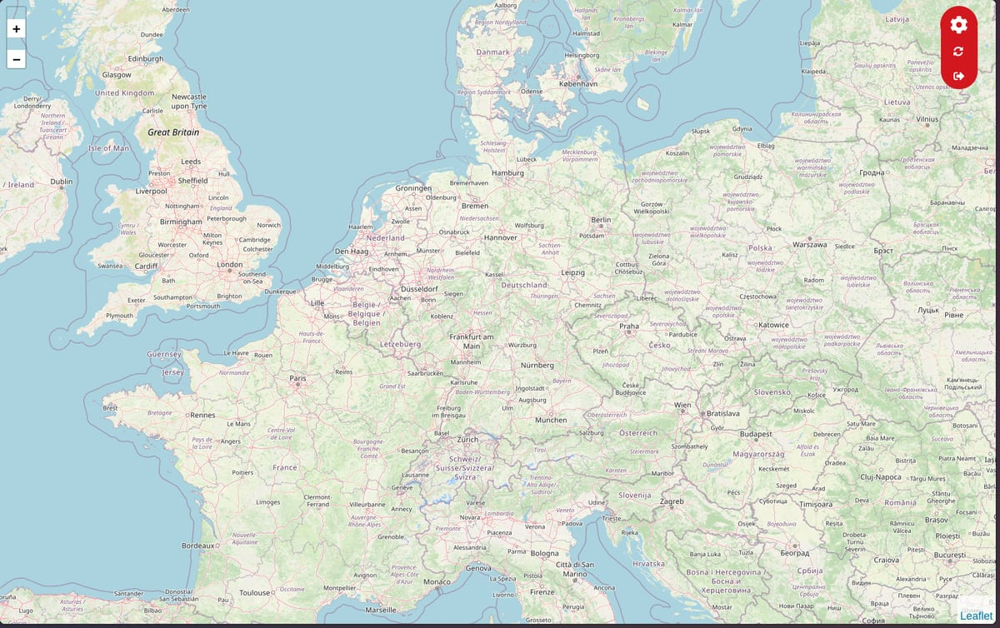

<div align="center">


# NeoPin Server

**The self-hosted backend for [NeoPin](https://github.com/vxnsin/NeoPin).**
Accepts WebSocket connections from your phones, remembers where everyone is, and serves a small web dashboard.

[](https://nodejs.org)
[](https://expressjs.com)
[](https://github.com/websockets/ws)
[](https://github.com/vxnsin/NeoPin)

<br>



</div>

---

## Contents

- [What it does](#what-it-does)
- [Quick start](#quick-start)
- [Docker](#docker)
- [Configuration](#configuration)
- [Console commands](#console-commands)
- [HTTP endpoints](#http-endpoints)
- [WebSocket protocol](#websocket-protocol)
- [Good to know](#good-to-know)

## What it does

- **Single process, no database.** One `server.js`, Express for HTTP and `ws` for WebSockets on the same port.
- **Shared-password auth.** Devices authenticate with the server password. Duplicate device names are rejected while the first one is online.
- **Location relay.** Any client can ask the server to poll all devices; the server fans out `requestLocation`, waits up to 2 seconds for answers and returns the combined list.
- **Web dashboard.** Log in at `/login.html`, get a Leaflet map with every device, a refresh button and dark/light theme.
- **Interactive console.** Type `help` in the running server to list devices, ping them or change the password.

## Quick start

Node.js 18 or newer.

```bash
git clone -b Server https://github.com/vxnsin/NeoPin.git neopin-server
cd neopin-server
npm install
node server.js
```

On first start a `.env` is written with `PORT=3012` and a default password. **Change the password before you expose the server.** Then open `http://<your-ip>:3012` in a browser or point the app at `ws://<your-ip>:3012`.

<div align="center">

</div>

## Docker

`docker-compose.yml`:

```yaml
services:
  neopin:
    image: node:22-alpine
    working_dir: /app
    command: sh -c "apk add --no-cache git && ([ -d .git ] || git clone -b Server https://github.com/vxnsin/NeoPin.git .) && npm install && node server.js"
    ports:
      - "3012:3012"
    volumes:
      - ./neopin:/app
    environment:
      - PORT=3012
      - PASSWORD=change-me
    stdin_open: true
    tty: true
    restart: unless-stopped
```

```bash
docker compose up -d
docker attach $(docker compose ps -q neopin)   # for the interactive console, detach with Ctrl+P Ctrl+Q
```

## Configuration

Values come from `.env` in the project root. Environment variables override the file.

| Variable | Default | Purpose |
|---|---|---|
| `PORT` | `3012` | HTTP and WebSocket port |
| `PASSWORD` | `neopin123`, written on first start | Shared password for apps and the dashboard |

## Console commands

| Command | Effect |
|---|---|
| `help` | List commands |
| `device-list` | Print every known device with position, last ping and status |
| `sendPing [deviceId]` | Ask one device (or all) for a fresh location |
| `changePassword <current> <new>` | Update the password in `.env`, takes effect after a restart |

## HTTP endpoints

The dashboard and the API share one cookie, set by `POST /login` and valid for 5 hours.

| Method | Path | Auth | Description |
|---|---|---|---|
| `GET` | `/` | cookie | Dashboard, redirects to `/login.html` when not logged in |
| `GET` | `/login.html` | – | Login page |
| `POST` | `/login` | – | Body `{ "password" }`, sets the auth cookie |
| `GET` | `/logout` | – | Clears the cookie |
| `GET` | `/api/getData` | cookie | All devices as `[{ deviceId, position, lastPing, status }]` |
| `POST` | `/api/sendPing` | cookie | Body `{ "deviceId"? }`, requests a location from one or all devices |

## WebSocket protocol

Connect to the same host and port. Messages are JSON. The first message must be the authentication.

**Client → Server**

| Message | Response |
|---|---|
| `{ "type": "authenticate", "deviceId", "password" }` | `{ "successful": true }`, or close code `4000` (`Unauthorized`, `Device already connected`) |
| `{ "type": "ping" }` | `{ "type": "pong" }` |
| `{ "type": "pingDevices" }` | Fans out `requestLocation` to all other devices, then `dataResponse` |
| `{ "type": "getData" }` | `dataResponse` from cache |
| `{ "type": "updatePosition", "latitude", "longitude" }` | none, stores position and timestamp |

**Server → Client**

| Message | Meaning |
|---|---|
| `{ "type": "requestLocation", "from"? }` | Reply with `updatePosition` |
| `{ "type": "dataResponse", "devices": [...] }` | Current device list |

## Good to know

- **State is in memory.** A restart forgets all devices and positions. Disconnected devices are kept and marked `offline` until the next restart.
- **Use TLS in the wild.** Put the server behind a reverse proxy (Caddy, nginx, Traefik) that terminates HTTPS, and use `wss://` in the app. The password travels in plain text otherwise.
- **The console needs a TTY.** When running as a service without stdin, the interactive commands are simply unavailable. Everything else works.

---

<div align="center">
<sub>Part of <a href="https://github.com/vxnsin/NeoPin">NeoPin</a> · made by <a href="https://github.com/vxnsin">Vensin</a></sub>
</div>
