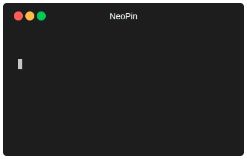

 

  

<h3 align="center">NeoPin - Backend</h3>

  NeoPin Backend handles device connections, authentication, and location updates through WebSockets.
   
  <a href="https://github.com/vxnsin/NeoPin"><strong>Explore the docs »</strong></a>
   
   
  <a href="https://github.com/vxnsin/NeoPin">View Demo</a>
  &middot;
  <a href="https://github.com/vxnsin/NeoPin/issues/new?labels=bug&template=bug-report---.md">Report Bug</a>
  &middot;
  <a href="https://github.com/vxnsin/NeoPin/issues/new?labels=enhancement&template=feature-request---.md">Request Feature</a>

### 🚀 How to Set Up NeoPin Backend

    

      <ol>
        <li>
          

            
📥 › <u>Clone the Repository</u>

            
<strong>🔹 Method 1: Git (recommended)</strong>

            <pre>git clone https://github.com/vxnsin/NeoPin.git  cd NeoPin</pre>
            
<strong>🔹 Method 2: Download ZIP</strong>

              <li><a href="https://github.com/vxnsin/NeoPin/archive/refs/heads/main.zip">Click here</a> to download the ZIP file.</li>
              <li>Extract the file on your computer.</li>
              <li>Open a terminal and navigate to the extracted folder.</li>
          

        </li>
        <li>💻 › Run <code>npm install</code></li>
        <li>🚀 › Run <code>node server.js</code></li>
      </ol>
    

  

    
  

